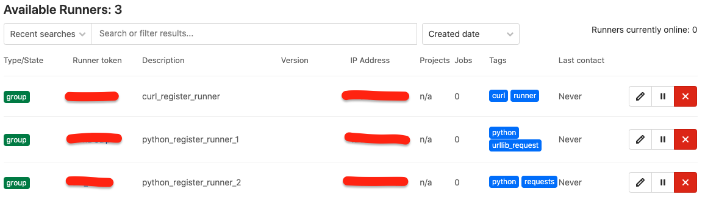

# This project will help you , how to register gitlab runner , not use `gitlab-runner`
## Curl
```bash
    # Register 
    curl --request POST "https://gitlab.com/api/v4/runners" \
    --form "token=<GITLAB_RUNNER_TOKEN>" \
    --form "description=curl_register_runner" \
    --form "tag_list=runner,curl"
    # output
    # {"id":2734186,"token":"q6uzKxxxxxRdzzpXXXXX"}
    # <runner token>
    # q6uzKxxxxxRdzzpXXXXX 
```

## Python 3 urllib
```python
    import urllib.request
    import urllib.parse
    import json
    url = "https://gitlab.com/api/v4/runners"
    payload = {"description": "python_register_runner_1",
               "tag_list": "python, urllib_request", "token": "<GITLAB_RUNNER_TOKEN>"}
    data = urllib.parse.urlencode(payload)
    data = data.encode('ascii')
    with urllib.request.urlopen(url=url, data=data) as f:
        res = f.read().decode('utf-8')
        print(res)
    resjson = json.loads(res)
    print(resjson['token'])
    # output
    # {"id":2740102,"token":"3yjprvXXXXXX-whTweGAp"}
    # <runner token>
    # 3yjprvXXXXXX-whTweGAp
```

## Python Requests
```python
    import json
    import requests
    url = "https://gitlab.com/api/v4/runners"
    # for python # for python requests
    requestspayload = dict(description="python_register_runner_2",
                           tag_list="python, requests", token="<GITLAB_RUNNER_TOKEN>")
    req = requests.post(data=requestspayload, url=url)
    jsonres = json.loads(req.content.decode('utf-8'))
    print(jsonres)
    print(jsonres['token'])
    # output
    # {"id":2740102,"token":"3yjprvXXXXXX-whTweGAp"}
    # <runner token>
    # "3yjprvXXXXXX-whTweGAp
```


---
## Here the docker executor template config.toml

### only replace <token> to  `"<runner token>"`  in `config.toml` 
```bash
    concurrent = 3
    check_interval = 0
    
    [session_server]
      session_timeout = 1800
    
    [[runners]]
      name = "For api docker executor runner template"
      url = "https://gitlab.com/"
      token = "<runner token>"
      executor = "docker"
      [runners.custom_build_dir]
      [runners.docker]
        tls_verify = false
        image = "alpine:latest"
        privileged = true
        disable_entrypoint_overwrite = false
        oom_kill_disable = false
        disable_cache = false
        pull_policy = "if-not-present"
        cache_dir = "/cache"
        volumes = ["/cache", "/var/run/docker.sock:/var/run/docker.sock"]
        shm_size = 0
      [runners.cache]
        [runners.cache.s3]
        [runners.cache.gcs]
```

---
Go to runner server run runner docker process or service 
```bash
    $ mkdir ~/gitlab-runner
    $ vi ~/gitlab-runner/config.toml # copy template and edit token .
    
    $ docker run -d -v ~/gitlab-runner:/etc/gitlab-runner \
      -v /var/run/docker.sock:/var/run/docker.sock \
      gitlab/gitlab-runner:alpine
```


# Delete Gitlab runner curl
```bash
# token = config.toml token .
curl --request DELETE "https://gitlab.com/api/v4/runners" --form "token=$token"
```
